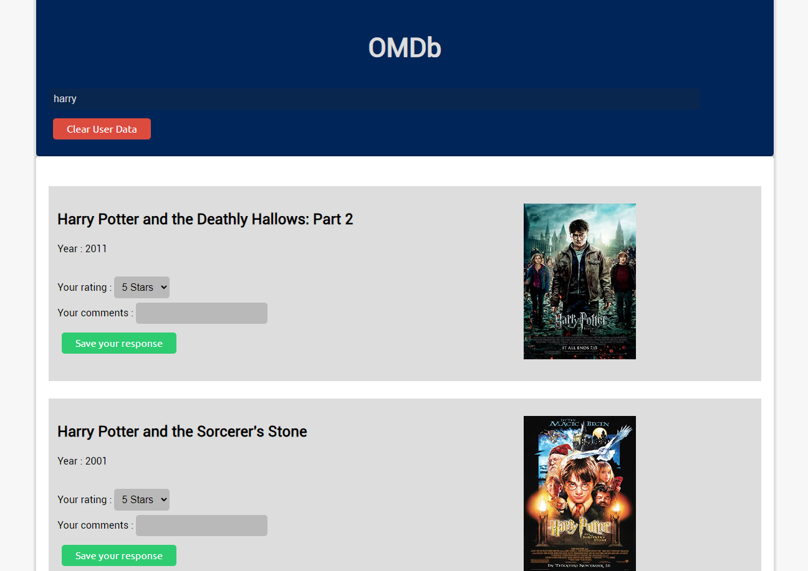
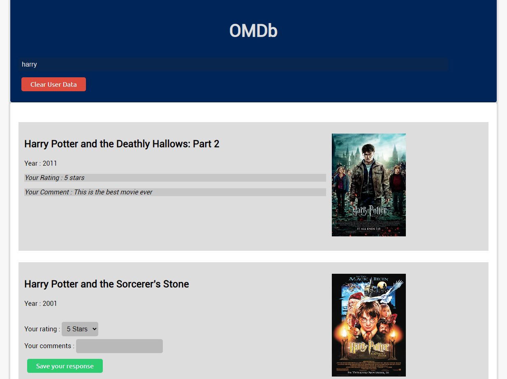
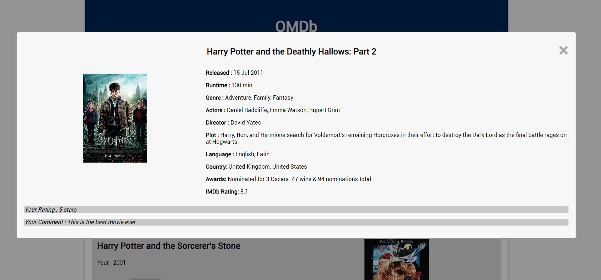

# CogoportOMDb

     
Save your own ratings and comments for the movies/shows.
  
Click on movie title to open a modal containing all the details.
  

### OMDb application with the following features:
- HTML Page Creation:
  1. Develop an HTML page that serves as the movie list application.
  2. Display a list of movies, each showing the movie's poster and name.

- Pagination:
  1. Implement pagination functionality for movie lists with more than 10 entries.
  2. Display previous and next buttons for navigation between pages.
  3. Show page numbers for easy navigation.

- Search Functionality:
  1. Integrate a search text box that allows users to directly search for movies using the OMDB API.
  2. Utilize the available data to provide search results in real-time as users type their search query.

- Movie Details Section:
  1. Create a movie details section that can be accessed by clicking on a movie from the list.
  2. Retrieve additional movie information from the OMDB API and display it in this section.

- User Ratings and Comments:
  1. Allow users to provide ratings for each movie on a scale of 1 to 5 stars.
  2. Implement a comment feature that enables users to leave comments about each movie.
- Save the user ratings and comments in the local storage to persist the data across sessions.

